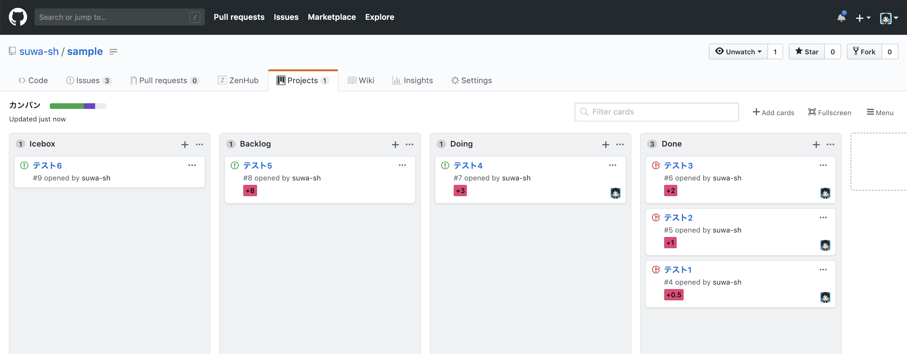
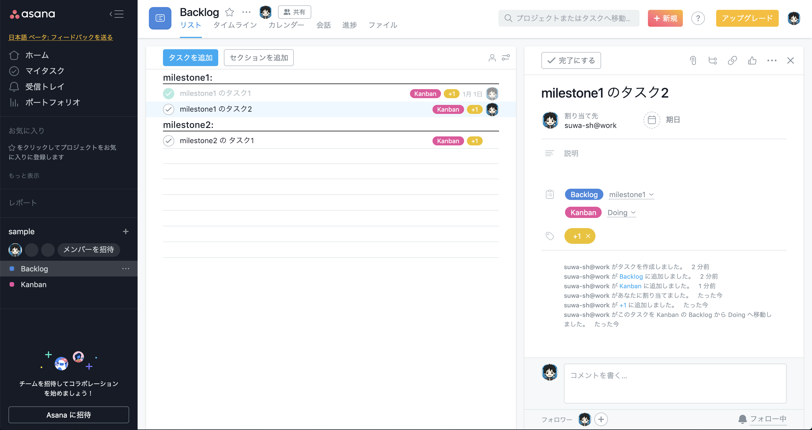
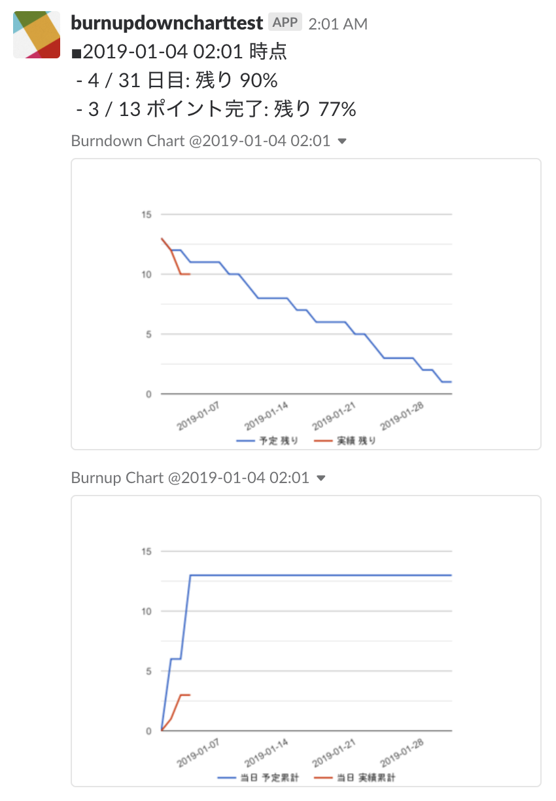

# progress-chart

## 概要

- バーンダウンチャート、バーンアップチャートを描画します。
- GitHub issue などの ITS のデータを同期して、チャートを更新します。
- 作成したチャートを Slack などのチャットサービスに自動投稿します。
- 毎朝 09:00 に 同期 > チャート更新 > チャット投稿 など、定期実行できます。

## イメージ

- GitHub issue

- Asana

- Slack

## 実行環境

- Google Sheets

## 対応サービス

### ITS

- Google Sheets での手動管理
- GitHub issue
- Asana
- GitLab issue ※未実装
- PivotalTracker ※未実装

### チャット

- Slack

## 利用方法

1. [スプレッドシートの最新バージョン](https://drive.google.com/drive/u/0/folders/16Ai4B_YIXrDRHjoPcNekkknA3mLU-sN7) をマイドライブにコピー
2. settingsシートを記入
    - chartの描画期間（スプリント や クォーター など）
    - ITS情報（オーナー や リポジトリ など）
    - チャット情報（bot token や チャンネル など）
2. ユーザープロパティを設定
    - Google Sheets メニューバー.ツール > スクリプトエディタ
    - スクリプトエディタ メニューバー.ファイル > プロジェクトのプロパティ
    - プロジェクトのプロパティ > ユーザープロパティ
        - progress-chart__its.token = ITS の API Token を追加
        - progress-chart__slack.bot_token = SlackBot の  API Token を追加
3. 【progress-chart】メニュー > Bulk
