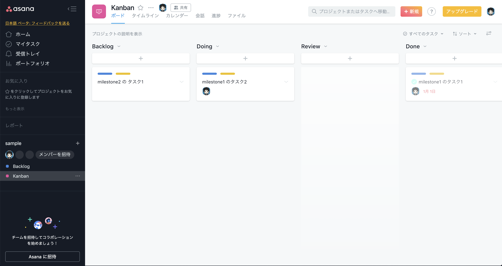

# progress-chart

## ■概要

- バーンダウンチャート、バーンアップチャートを描画します。
- GitHub issue などの ITS のデータを同期して、チャートを更新します。
- 作成したチャートを Slack などのチャットサービスに自動投稿します。
- 毎朝 09:00 にチャット投稿 など、定期実行できます。

## ■イメージ

### Slack

### GitHub issue

### Asana

## ■チャートの目的

### バーンダウンチャート

- 現在を把握して、未来を考える
  - 予定している総ポイント数が、期間内に完了できそうか？
  - ベロシティはどの程度か？
  - どのくらいのゆとりがあるのか？

### バーンアップチャート

- 過去をふりかえり、未来を考える
  - どんな計画変更をかけてきたのか？
  - 変更の結果、ベロシティ/ゆとりにどんな変化があったのか？

## ■対応サービス

### ITS

- Google Sheets での手動管理
- GitHub issue
- Asana
- GitLab issue ※未実装
- PivotalTracker ※未実装

### チャット

- Slack
- Google Chat ※未実装

## ■利用方法

1. [スプレッドシートの最新バージョン](https://docs.google.com/spreadsheets/d/1sJpKak1w9UyFUO6CYfkxlMoDc_Vsq5YjJUZoXRVmLaE/copy) をマイドライブにコピー
2. settingsシートを記入
    - chartの描画期間（スプリント や クォーター などの期間を指定）
    - ITS情報（オーナー や リポジトリ、認証情報 など）
    - チャット情報（チャンネル や 投稿に含めるリンク、認証情報 など）
3. 【progress-chart】メニュー > Bulk

## ■ストーリーポイントの管理

- フォーマット: `+<ポイント>`
  - 例: `+0.5`, `+1`, `+2`, `+3`, `+5`, `+8`, `+13` ...
- フィールド
  - GitHub issue: label
  - Asana: tag

## ■Tips

- **優先度を下げたバックログアイテムを、チャートから除外したい**
  - backlogからiceboxに移動すれば、チャートから除外されます
    - `[list] backlog`シートの対象行を`[list] icebox`シートに移動
    - ※次回以降の同期でも、除外され続けます
- **ITS上で削除したバックログアイテムが、スプレッドシートに反映されない**
  - バックログをクリアして再取得すれば最新化できます
    - `[list] backlog`シートを空にする
    - `【progress-chart】メニュー / Bulk`で再取得
- **バーンダウンとバーンアップで総ポイント数が一致しない**
  - `描画期間より古い作成日のバックログアイテム`が含まれていると、描画がうまくできません
    - `[list] backlog`シートで作成日を、描画期間の開始日に合わせる
    - ※以降の同期でも、作成日は更新されません
